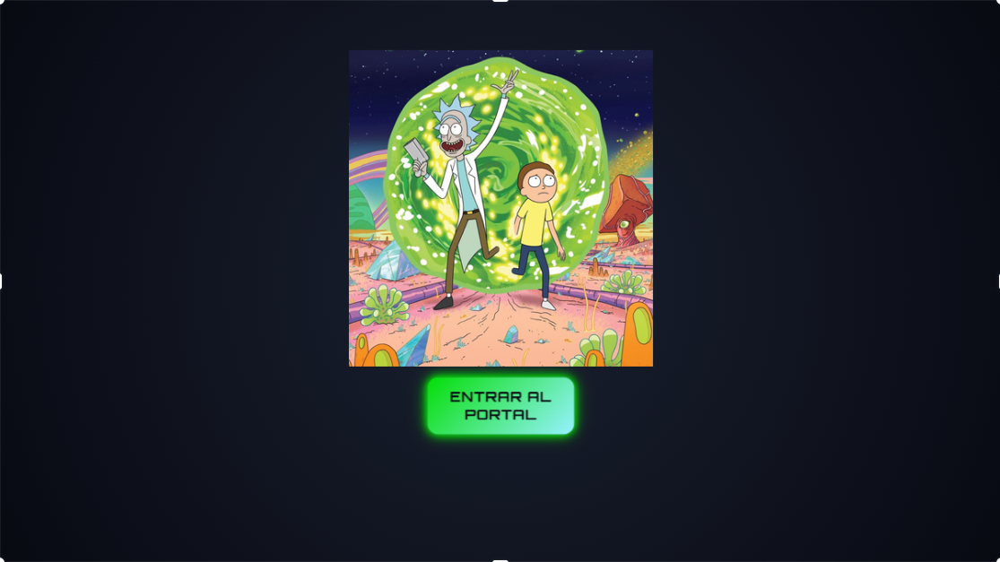
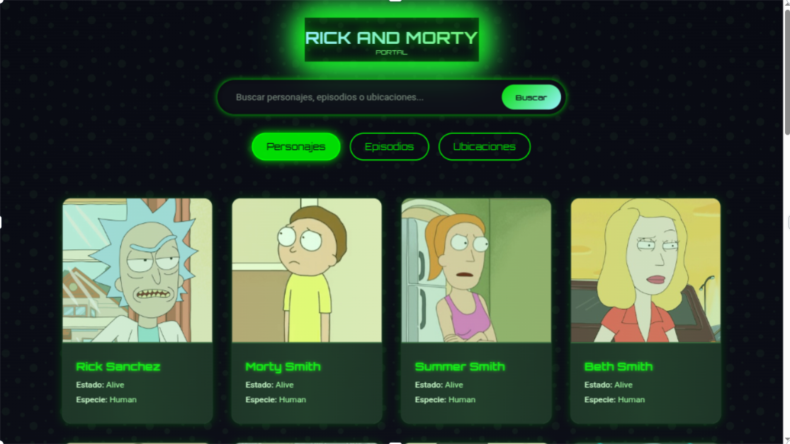
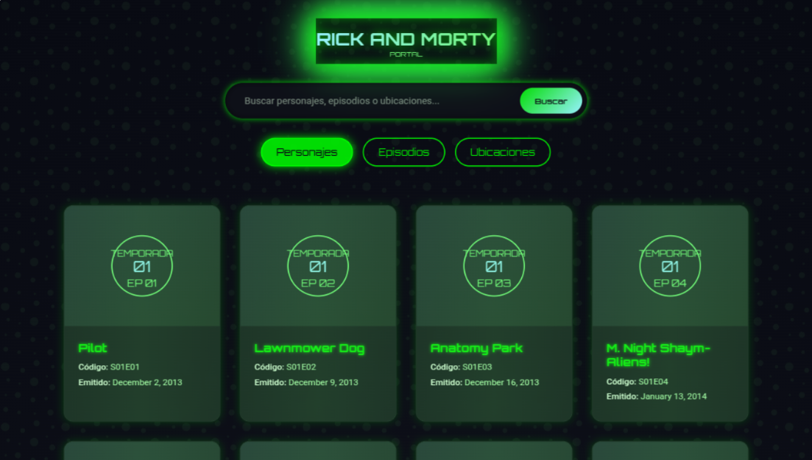
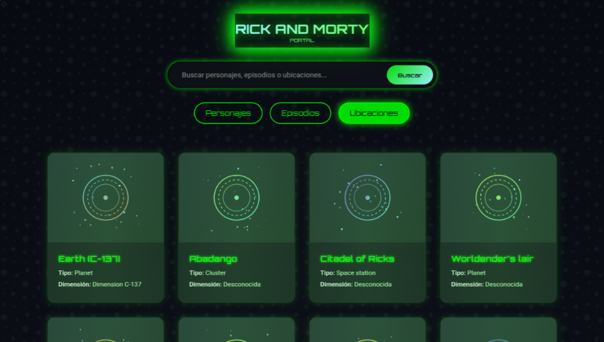

# 🌌 Rick and Morty API Explorer

Proyecto web interactivo que explora el universo de **Rick and Morty** utilizando su API pública. Diseñado con una interfaz futurista, animaciones llamativas y navegación fluida para consultar personajes, episodios y locaciones.

---

## 🔗 Demo en línea

📲 Mira la app funcionando en GitHub Pages:  
[https://tuusuario.github.io/rick-and-morty-app](https://tuusuario.github.io/rick-and-morty-app)

---

## 🧰 Tecnologías utilizadas

- HTML
- CSS (estilo personalizado y responsive)
- JavaScript (modular y asincrónico)
- API pública: [Rick and Morty API](https://rickandmortyapi.com/)

---

## 📁 Estructura del Proyecto

```
📂 rick-and-morty-app/
├── index.html           # Página principal
├── styles.css           # Estilos futuristas
├── main.js              # Lógica JS y consumo de API
├── img/                 # Imágenes y recursos visuales
└── README.md            # Documentación del proyecto
```

---

## ⚙️ Funcionalidades

✅ **Pantalla de bienvenida** con imagen destacada  
✅ **Navegación por secciones**: personajes, episodios y ubicaciones  
✅ **Tarjetas interactivas** con datos clave y detalles ampliables  
✅ **Buscador de personajes** por nombre  
✅ **Paginación dinámica** para evitar sobrecarga de contenido  
✅ **Responsive Design**: diseño adaptable a dispositivos móviles  
✅ **Código modular y limpio**, con separación por funciones

---

## 🧪 ¿Cómo probarlo localmente?

1. Clona el repositorio:

```bash
git clone https://github.com/SantiagoRomero7/rick-and-morty-app.git
```

2. Abre el archivo `index.html` con tu navegador.

3. O sube el proyecto a GitHub Pages para verlo en línea.

---

## 📸 Maquetaciòn 









Este fue el diseño borrador de la pagina web antes de comenzar a realizarla, el diseño fue creado con canva, se intento hacer lo màs posible parecido, pero se puede ver que hay algunas diferencias.

---

## 👨‍💻 Autor

**Tu Nombre Aquí**  
Estudiante de Desarrollo Web en Campuslands  
📧 santiagoinstagram23@gmail.com 

💼 [GitHub](https://github.com/SantiagoRomero7)

---

## 📚 Aprendizajes

- Consumo de APIs REST con `fetch` y `async/await`
- Manipulación avanzada del DOM
- Modularización de código JS
- Diseño responsivo y UI personalizada
- Paginación y manejo de eventos

---

## 🧠 Créditos

- [Rick and Morty API](https://rickandmortyapi.com/)
- Imágenes y datos oficiales pertenecen a sus respectivos creadores

---

## 📄 Licencia

Este proyecto fue creado con fines educativos.  
